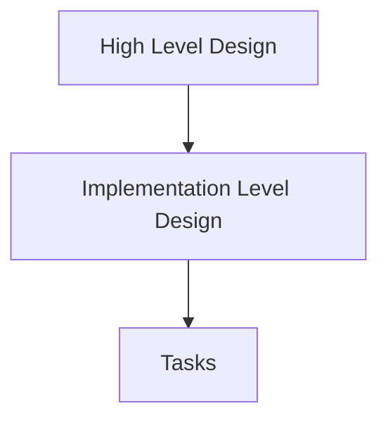

# Architecture

## Process

System architecture should be presented in a High-Level Design (HLD) document,
which should be accessible to different team members. HLDs present system-wide
overview of main functional requirements, conceptual and logical data models,
API definitions, logical components and interactions, data and process flows,
security and compliance design, and service operations architecture.

With HLDs in place, the project then is divided into smaller, more manageable pieces
which are called Implementation Level Design (ILD). They define more detailed
functioncal requirements, physical data models, API structure, implementation approaches,
dependencies, limitations, operations process, documentation, changes in HLD and 
future work.

Each HLD must not be longer than 10 pages (including diagrams and text).
HLDs have only a broad design without enough details to begin actual implementation.

