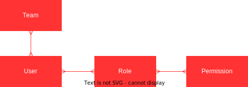
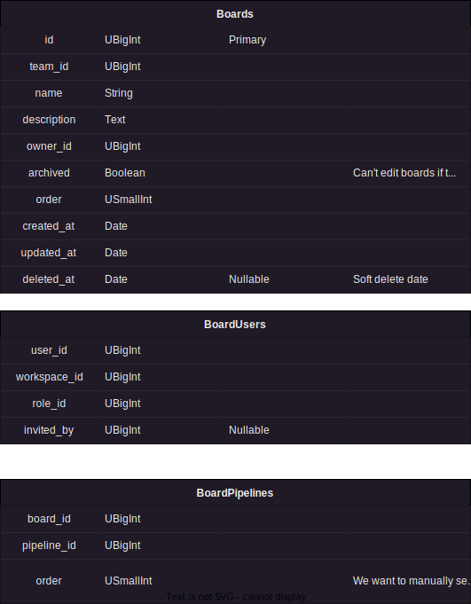
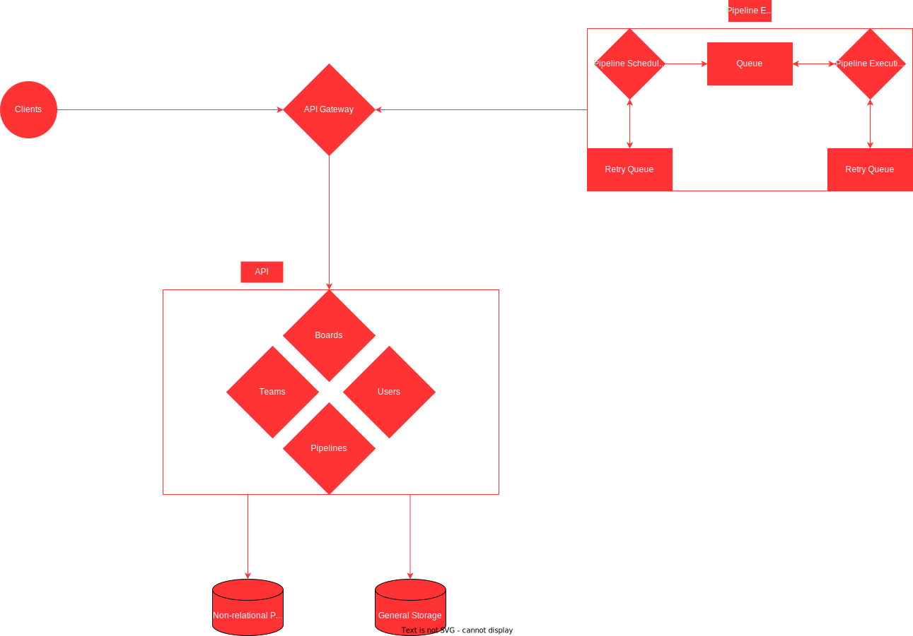

# High Level Design for Restroy MVP

## Table of Contents

1. Terminology
2. Overview
3. Requirements
4. Conceptual Data Model
5. Components
6. Architecture

## Terminology

* _Script_: A user-defined code snippet with additional settings, 
  including environment variables, that can be executed to perform 
  a variety of tasks. Scripts provide users with the flexibility 
  to customize their code and settings based on their specific requirements.
* _Pipeline_: A graphical representation of a series of separate 
  scripts that are interconnected to form a workflow. Pipelines 
  define the order and dependencies of scripts, enabling the 
  automated execution of tasks in a structured manner, 
  often involving data transformation, analysis, or deployment processes.
* _Board_: A consolidated collection of multiple pipelines that are 
  associated with a single team. Boards serve as organizational units, 
  allowing teams to manage and track the progress of their pipelines 
  in a centralized manner. By grouping related pipelines together, 
  teams can effectively monitor and coordinate their automation workflows.

## Overview

Restroy Backend MVP focuses on providing a robust backend system to support 
pipeline execution and management. Users will have the ability to set up 
and customize pipelines, while the system ensures seamless execution and 
provides insights on pipeline progress. The MVP emphasizes core functionalities 
such as user, team, board, and pipeline management, laying the foundation 
for future enhancements and feature expansions. The design aims to deliver 
a user-friendly and efficient experience, enabling users to automate their 
tasks effectively. The backend system will be designed with scalability, 
reliability, and performance in mind, ensuring a smooth pipeline execution 
process for users and supporting their collaboration needs within teams.

## Requirements

### Functional

* _User Management_: Provide user registration, authentication, and authorization 
  capabilities for account creation, profile management, and password reset.
* _Team Management_: Enable the creation and management of teams, including 
  inviting members, assigning roles, and controlling access within teams.
* _Board Management_: Allow the creation and customization of boards to organize pipelines.
* _Pipeline Configuration_: Enable users to define and configure pipelines 
  by specifying script sequences, dependencies, and various settings.
* _Pipeline Execution_: Support automated execution of pipelines triggered 
  manually or scheduled, providing real-time feedback on script progress and results.
* _Pipeline Monitoring_: Provide monitoring capabilities to track pipeline status, 
  progress, and execution history.
* _Script Management_: Enable users to create, update, and manage scripts 
  with the ability to specify script parameters, dependencies, and versioning.

### Non-Functional

* _Scalability_: The system should be designed to handle increasing user 
  and pipeline loads without compromising performance. It should support 
  horizontal scalability, allowing for easy expansion by adding more resources 
  or instances as needed
* _Security_: The system should prioritize the security of user data, pipelines, 
  and system resources. It should protect against unauthorized access, data breaches, 
  and vulnerabilities. It should enforce secure authentication and authorization 
  mechanisms and employ data encryption for sensitive information.
* _Performance_: The system should deliver high performance, ensuring 
  speedy execution of pipelines and minimal latency for user interactions. 
  It should optimize resource utilization and response times to provide 
  a smooth and responsive user experience.

## Conceptual Data Model

### Core Model

| Concept | Description | Example |
| --- | --- | --- |
| Team | * Team is a customer organization   * From a team, people can create boards | Company |
| Board | * Board is a collection of pipelines   * Boards belong to a team | Board with various notifications |
| Pipeline | * Pipeline is a graph of scripts   * Pipelines belong to a board | Email notification pipeline |
| Script | * Script is a Lua program   * Script may have a configuration   * Scripts belong to a pipeline | Script that sends email to subscribers |
| Configuration | * Configuration is a key-value table   * Configuration belongs to a script | Table that defines API keys |

### Authorization Model

| Concept | Description | Example |
| --- | --- | --- |
| Team | * Team is a collection of users with assigned roles | Company |
| User | * User is who uses the system   * User belongs to a team | Person |
| Role | * Role is a collection of permissions   * Roles are assigned to users | Administrator |
| Permission | * Permission specifies which actions a user is allowed to perform   * Permissions are assigned to roles | Create Pipeline |

### API

## Components

### Application Servers

The Application Servers component plays a crucial role in handling the various 
functionalities of the system. For the MVP implementation, we'll use a single backend 
service responsible for processing API requests. This backend service acts as the 
primary entry point for users and client applications to interact with the system. It 
handles incoming requests, performs necessary business logic, and communicates with 
the Datastores component to retrieve or store relevant data.

Additionally, another backend service is dedicated to handling pipeline execution. 
This service is responsible for executing the configured pipelines and coordinating 
the execution flow. It interacts with the necessary resources, such as external 
systems or services, to carry out the tasks defined within the pipelines. The 
separation of the pipeline execution functionality into a dedicated service ensures 
better scalability, modularity, and easier maintenance as the system evolves.

### Datastores

The Datastores component is responsible for persisting and managing the system's data. 
For the MVP implementation, we'll utilize a single SQL database to store all relevant 
data entities such as users, pipelines, and other associated information.

By consolidating the data into a single SQL database, it simplifies the initial 
implementation and reduces the complexity of managing multiple datastores. As the 
system matures and scales, it may be necessary to consider introducing data 
partitioning, sharding, or adopting other data management techniques to handle 
increased data volumes and optimize performance. However, for the MVP stage, a single 
SQL database provides a solid foundation to store and manage the necessary data 
entities efficiently.

#### Roles Table

#### Users Table

#### Teams Table

#### Boards Table

#### Pipelines Table

## Architecture

### Backend

### Pipeline Executioner

