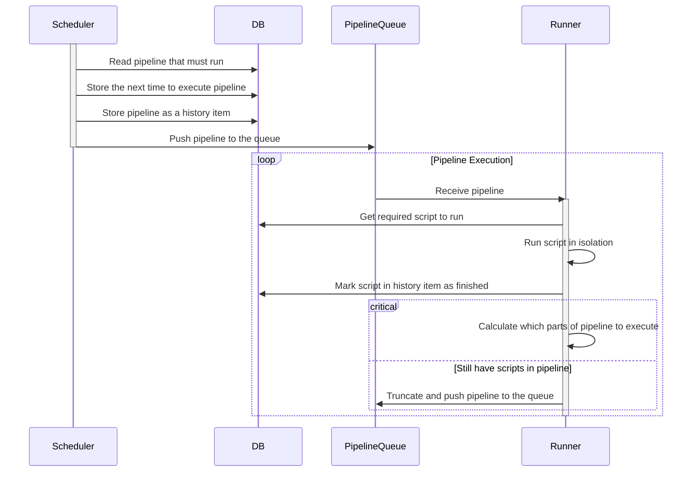

# Pipeline

## Design

```mermaid
sequenceDiagram
    activate Scheduler
    Scheduler->>DB: Read pipeline that must run
    Scheduler->>DB: Store the next time to execute pipeline
    Scheduler->>DB: Store pipeline as a history item
    Scheduler->>PipelineQueue: Push pipeline to the queue
    deactivate Scheduler
    loop Pipeline Execution
      PipelineQueue->>Runner: Receive pipeline
      activate Runner
      Runner->>DB: Get required script to run
      Runner->>Runner: Run script in isolation
      Runner->>DB: Mark script in history item as finished
      critical
        Runner->>Runner: Calculate which parts of pipeline to execute
      option Still have scripts in pipeline
        Runner->>PipelineQueue: Truncate and push pipeline to the queue
      end
    end
    deactivate Runner
```
